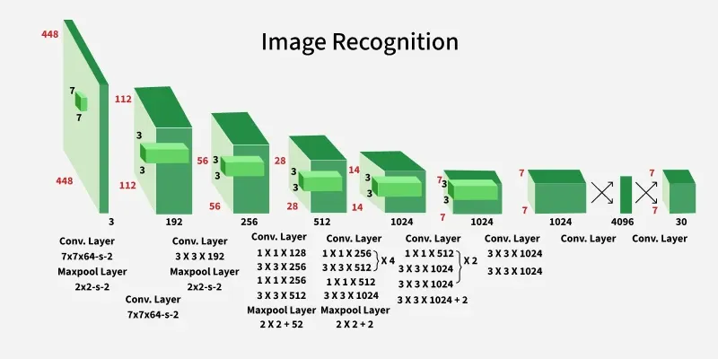

# Object-Detection-Research

- Given a video, find the geometry and position of an object:
   - OpenCV and YOLO
- Get the text from the object
   - EasyOCR
- Detect whether that's a single language or a multi-language
   - EasyOCR
- Find if the detected text is vulgar or not
   - EasyOCR

- We'll determine certain things based on the:
   - Position (Geographical)
   - Geometry
   - Text
   - Language

## YOLO (You Only Look Once)

- Only one forward pass is required through the network to make the final prediction

### Input Processing

- Model accepts an image as input, resizes it into 448x448 pixels ensuring the aspect ratio is preserved using padding.

### Backbone CNN Network

- Model consits of 24 convolutional layers and 4 max-pooling layers
- To reduce the number of parameters and compress channels, 1x1 convolutions are used
- This is followed by 3 x 3 convolutions to capture spatial patterns in the feature maps.
- Following the convolutional layers, the architecture has 2 fully connected layers.
   - The final fully connected layer produces an output of shape (1, 1470)

## Keywords:

1. Aspect Ratio: The ratio of the width to the height of the image.
2. Padding: Adding extra pixels around the borders of an image before applying convolution operations.
   - This helps preserve the spatial dimensions of the image
   - Prevents the loss of information at the edges during processing.
3. Convolutional Neural Network (CNN): A type of neural network that is commonly used for image processing and computer vision tasks.
   - It is a type of neural network that is composed of layers of neurons that are connected to each other in a grid-like pattern.
   - Each neuron is connected to a subset of the neurons in the previous layer.
   - The neurons in the previous layer are connected to the neurons in the next layer.
   - The neurons in the previous layer are connected to the neurons in the next layer.

4. Convolution: A mathematical operation that is used to extract features from an image.
5. Convolutional Layer: A layer in a neural network that is used to extract features from an image.
6. Max-Pooling Layer: A layer in a neural network that is used to reduce the spatial dimensions of an image.

## References:

1. [Yolo Model](https://www.geeksforgeeks.org/machine-learning/yolo-you-only-look-once-real-time-object-detection/)
